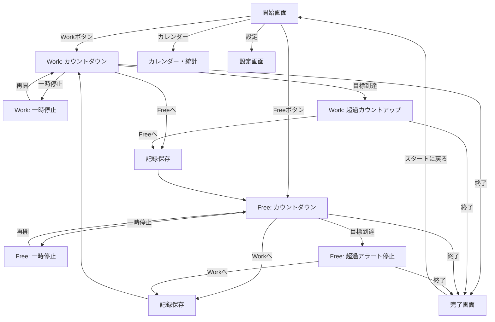

# 状態遷移図 - v2.0.0

## 遷移図

## 状態詳細

| 画面/状態 | アイコン | 計測方式 | ボタン構成 (大 / 小) |
|-----------|----------|----------|----------------------|
| Work(通常) | ダンベル | 減算 | Freeへ / 一時停止, 終了 |
| Work(超過) | ダンベル | 加算 | Freeへ / 一時停止, 終了 |
| Free(通常) | コントローラー | 減算 | Workへ / 一時停止, 終了 |
| Free(超過) | コントローラー | 停止(0:00) | Workへ / 終了 |

## 特記事項

1. **記録のタイミング**: モード切り替え時（Freeへ/Workへ）および最終的な「終了」ボタン押下時に、実施したWork時間がカレンダーDBへ蓄積される。
2. **通知の連動**: バックグラウンド移行時に、次の状態変化（目標到達）に合わせて通知を予約。Free超過時は、さらに1分間隔のローカル通知を動的にスケジュールする。
