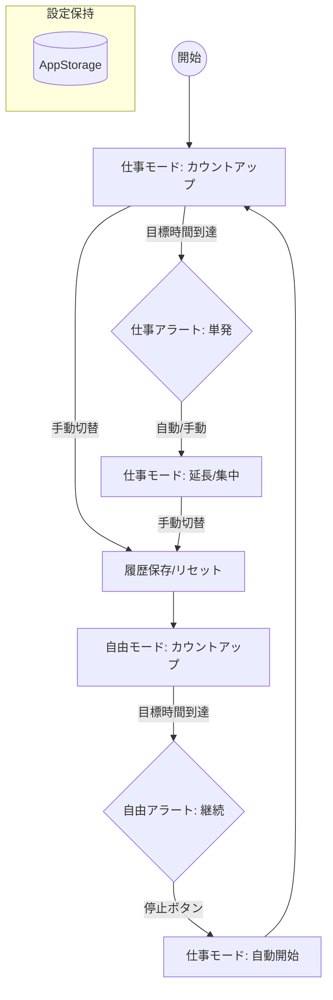

# 状態遷移図 (State Transition Diagram)

修正された要件に基づいた、タイマーの状態遷移図です。

## 主要な遷移の解説

1.  **仕事モード (Work Mode)**:
    - 「やるべきこと」を行うフェーズ。目標時間を過ぎても計測を続け、集中状態（フロー）を妨げないようにします。
    - 超過時はタイム表示がオレンジ色に変わり、延長計測であることがひと目でわかります。

2.  **自由モード (Free Mode)**:
    - 「好きなこと」でリフレッシュするフェーズ。目標時間に達するとタイマーが止まり、アラートが鳴り続けます。
    - アラートを止めるという「能動的なアクション」が、次の作業への切り替えスイッチとなります。

3.  **相互自動移行**:
    - 自由モードのアラートを止めると、**即座に仕事モードが自動的に開始**されます。これにより「作業を始めるのが面倒」という心理的な壁を乗り越えやすくします。

## 主要な遷移の解説

1.  **仕事モード (Work Mode)**:
    - カウントアップを行い、設定時間を過ぎると自動的に「延長状態」に遷移します。
    - 延長状態では文字色がオレンジに変わりますが、タイマーは止まりません。

2.  **自由モード (Free Mode)**:
    - カウントアップを行い、設定時間に達すると「アラート鳴動状態」になります。
    - アラートは「停止ボタン」を押すまで鳴り続けます。

3.  **自動移行**:
    - 自由モードでアラートを停止させると、**直ちに仕事モードへ移行し、タイマーが自動でスタート**します。
