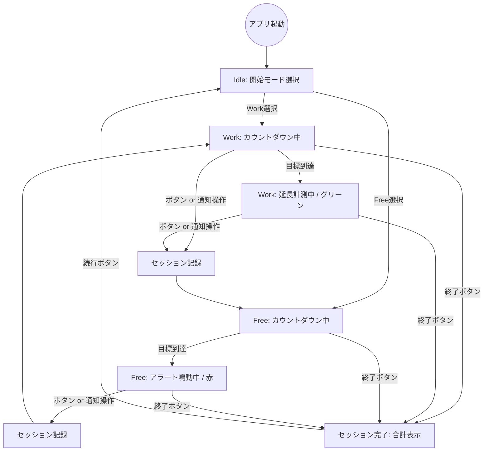

# 状態遷移図 - v1.7.0

## 遷移図

## 状態一覧

| 状態 | モード | 表示 | 色（Text/Icon） | アラート |
|------|--------|------|-----------------|----------|
| カウントダウン中 | Work | 残り時間 | 白 | なし |
| 延長計測中 | Work | 超過時間 | グリーン | 単発(Option) |
| カウントダウン中 | Free | 残り時間 | 白 | なし |
| アラート鳴動中 | Free | 0:00 | 赤 | 継続鳴動 |

## 遷移ルール

1. **ボタン/通知押下時**: セッションを記録 → 反対モードへ移行 → 自動スタート。
2. **ロック画面**: 通知アクション「STOP / 次へ」によりアプリを開かずにモード移行可能。
3. **セッション終了**: 右上の「終了」ボタンで、それまでの Work 合計時間を算出し完了画面へ。
