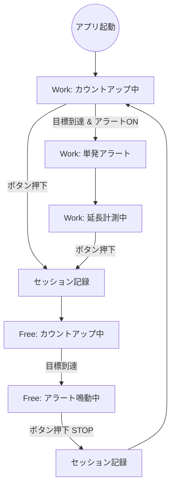

# 状態遷移図 - v1.5.0

## 遷移図

## 状態一覧

| 状態 | モード | カウント | ボタン表示 | アラート |
|------|--------|----------|-----------|----------|
| カウントアップ中 | Work | 進行中 | "Free に切替" | なし |
| 延長計測中 | Work | 進行中（オレンジ） | "Free に切替" | なし |
| カウントアップ中 | Free | 進行中 | "Work に切替" | なし |
| アラート鳴動中 | Free | 停止 | "STOP"（赤） | 継続鳴動 |

## 遷移ルール

1. **ボタン押下時（共通）**: セッションを記録 → 反対モードに切替 → カウントを0にリセット → 自動スタート
2. **Free目標到達**: カウント停止 → アラート鳴動開始 → ボタンが「STOP」に変化
3. **Work目標到達**（アラートON時のみ）: 単発音 → そのまま延長計測を継続
