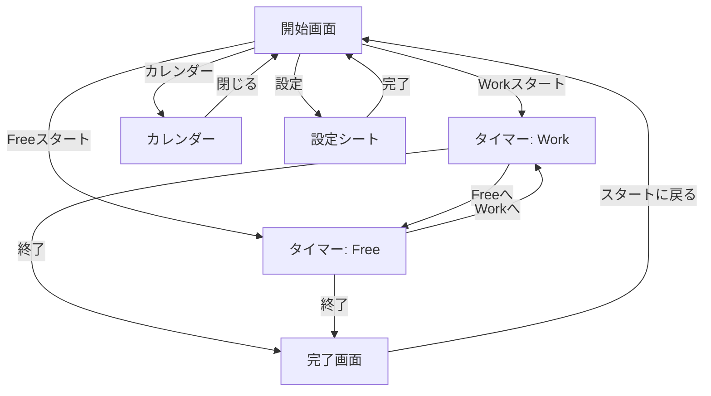
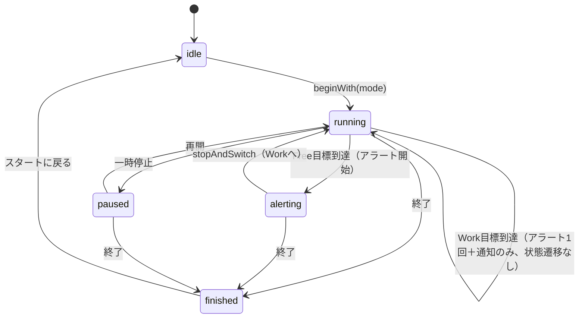

# 状態遷移定義 - v3.0

## 1. 画面遷移図



## 2. タイマー状態遷移



## 3. モード別状態詳細

| モード | 状態 | 計測 | タイマー色 | 背景 | ボタン |
|--------|------|------|-----------|------|--------|
| Work | カウントダウン | 減算 | 白 | 暖色グラデーション | Freeへ(大), 一時停止(小), 終了(小) |
| Work | 超過 | 加算 | セージグリーン | 暖色グラデーション | Freeへ(大), 一時停止(小), 終了(小) |
| Work | 一時停止 | 停止 | 白/緑 | 暖色グラデーション | Freeへ(大), 再開(小), 終了(小) |
| Free | カウントダウン | 減算 | 白 | 寒色グラデーション | Workへ(大), 一時停止(小), 終了(小) |
| Free | 超過 | 0:00停止 | コーラル | 寒色グラデーション | Workへ(大), 一時停止(非活性), 終了(小) |
| Free | 一時停止 | 停止 | 白 | 寒色グラデーション | Workへ(大), 再開(小), 終了(小) |

## 4. データフロー

### セッション中のWork時間累積

```
beginWith(.work) → sessionWorkSeconds = 0
                                                 
    Work 計測中 (elapsed が増加)                 
        │                                       
    stopAndSwitch() → sessionWorkSeconds += elapsed
        │              elapsed = 0, mode = .free 
    Free 計測中                                  
        │                                       
    stopAndSwitch() → mode = .work, elapsed = 0  
        │                                       
    Work 計測中 (elapsed が増加)                 
        │                                       
    finishSession() → sessionWorkSeconds += elapsed
                      SessionRecord に保存        
                      phase = .finished          
```

### 記録の保存
- `finishSession()` 時のみ SessionRecord を作成
- `mode` は常に `.work`、`durationSeconds` は累積 Work 時間

## 5. アラート・通知タイミング

| トリガー | 条件 | アラート音 | 通知ID |
|---------|------|----------|--------|
| Work 目標到達 | `alertInWork == true` かつ未発火 | 1回鳴動 | `TIMER_ALERT` |
| Free 超過開始 | `elapsed >= target` | 鳴動開始 | `TIMER_ALERT` |
| Free 超過中 | アプリ起動中3秒ごと | 繰り返し | — |
| Free 超過中 | 60秒ごと | — | `TIMER_ALERT` |
| バックグラウンド移行 | `phase == .running` かつ未超過 | — | `TIMER_ALERT_BG` |

## 6. バックグラウンド復帰ロジック

```
フォアグラウンド復帰:
  if backgroundDate != nil:
    diff = now - backgroundDate
    if phase == .running:
      elapsed += diff
      if mode == .free && elapsed >= target:
        elapsed = target
        phase = .alerting
        アラート再開（3秒間隔）
    if phase == .alerting:
      アラート再開（3秒間隔）
    // phase == .paused の場合は何もしない
    backgroundDate = nil
    キャンセル: TIMER_ALERT_BG
```
